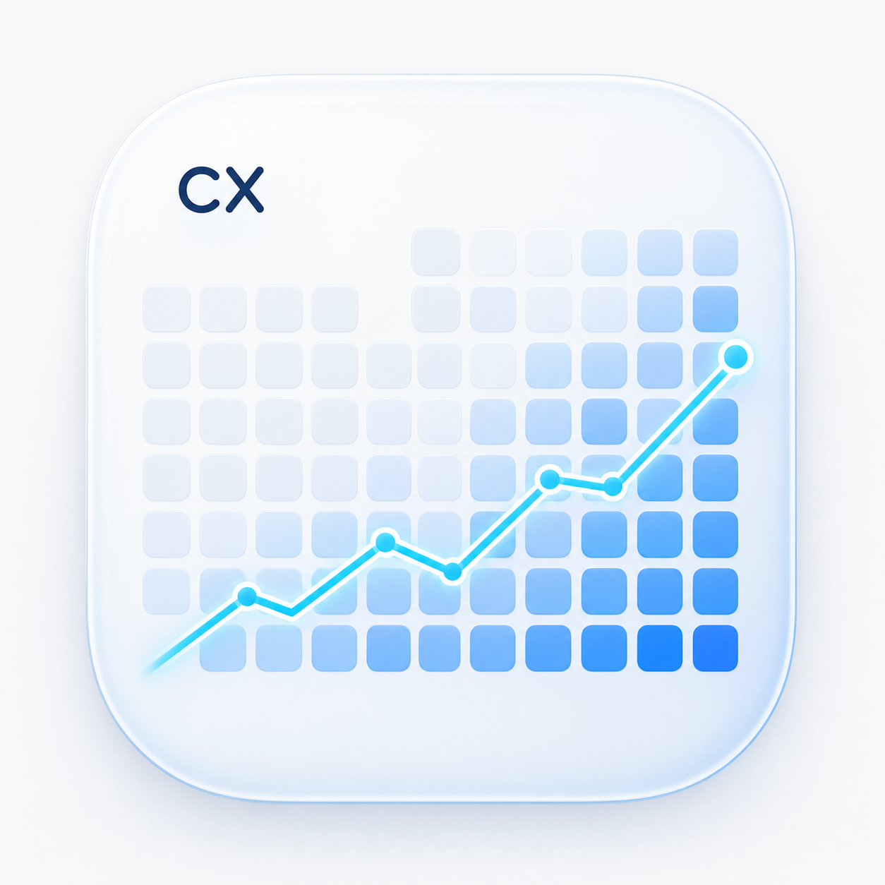
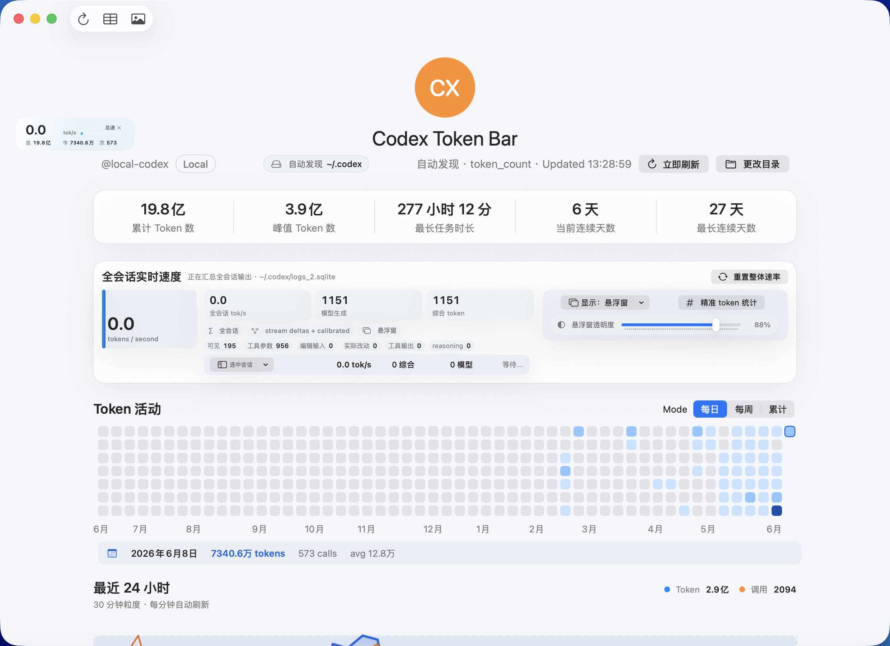
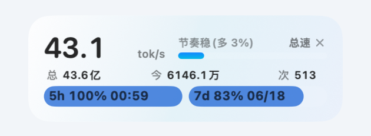

# Codex Token Bar

<p align="center">
  <a href="README.md">English</a> | <a href="README.zh-CN.md">简体中文</a>
</p>

<table align="center">
  <tr>
    <td align="center" width="180">
      <br>
      <strong>Codex Token Bar</strong>
    </td>
    <td align="center" width="280">
      <br>
      欢迎扫码加入群聊，讨论使用问题、交流想法，也会发布产品发布和更新通知。
    </td>
  </tr>
</table>

Codex Token Bar 是一个本地优先的 macOS SwiftUI 应用，用来从本地会话日志可视化 Codex token 使用量和实时输出速度。

<p align="center">
  
</p>

<p align="center">
  
</p>

## 安装

推荐使用一行命令安装：

```bash
curl -fsSL https://raw.githubusercontent.com/hututuo/codex-token-bar/main/install.sh | bash
```

安装脚本会下载最新的 `.app.zip` release，解压后安装到可写的 `/Applications`，否则安装到 `~/Applications`，同时移除常见的 `com.apple.quarantine` 标记并打开应用。

这可以减少浏览器下载未签名应用后 macOS 提示“应用已损坏，无法打开”的情况。但它不能替代 Apple Developer ID 签名和 notarization。公司 MDM、安全软件或更严格的 macOS 策略仍然可能阻止未签名应用运行。

## 更新

更新也使用同一条命令。它会始终下载最新 GitHub release，并替换已安装的应用：

```bash
curl -fsSL https://raw.githubusercontent.com/hututuo/codex-token-bar/main/install.sh | bash
```

## 功能

- 自动发现本地 Codex 数据目录：已保存目录、`CODEX_HOME`、`~/.codex`、`~/.config/codex`，以及用户主目录下的一层候选目录。
- 读取本地 Codex `sessions/**/*.jsonl` 中的 `token_count` 事件。
- 汇总 token 用量、调用次数、连续使用天数、峰值用量和会话数量。
- 在顶部显示当前数据源，并提供手动切换目录入口。
- 显示类似个人贡献图的年度热力图，并支持最近格点吸附 hover 明细。
- 热力图模式含义清晰：每日总量、自然周总量、截至选中日期的累计总量。
- 从本地流式日志追踪全会话 Codex 实时输出速度，并提供单会话下钻行。
- 提供轻量悬浮窗，显示总 tok/s、累计 token、今日 token 和今日请求次数。
- 支持精确 `o200k_base` token 统计开关；默认使用轻量校准估算以降低开销。
- 显示最近 24 小时 token 和请求活动曲线，粒度为 30 分钟，并支持 hover 明细。
- 每分钟自动刷新，也支持手动刷新。
- 支持导出 PNG 分享图和 CSV 汇总。

## Releases

版本更新说明和可下载 app zip 都在 [GitHub Releases 页面](https://github.com/hututuo/codex-token-bar/releases)。

## 隐私

当前版本只读取本地文件。它不会上传日志、prompt、输出内容或账号数据。

## 数据源

应用会把包含以下内容的目录视为 Codex Home：

```text
sessions/
state_5.sqlite
```

`sessions/` 用于精确 token_count 事件统计。`state_5.sqlite` 在可用时用于补充元数据。

## 从源码运行

给想从源码运行的贡献者：

```bash
brew install git-lfs
git lfs install
scripts/prepare_tiktoken_lfs.sh
swift run CodexTokenBar
```

需要 `git-lfs` 是因为精确 `o200k_base` tokenizer 依赖一个 Swift 二进制 FFI 包。准备脚本只会获取此应用需要的 macOS binary slice。如果 tokenizer 在运行时无法加载，应用会回退到轻量校准估算。

## 本地打包 App

```bash
brew install git-lfs
git lfs install
chmod +x scripts/package_app.sh
scripts/package_app.sh debug
open "dist/Codex Token Bar.app"
```

## 说明

这个项目刻意先以 Swift Package 形式开始，方便贡献者无需 Xcode project 也能构建。后续可以再加入签名后的 `.app` wrapper。

## License

MIT
